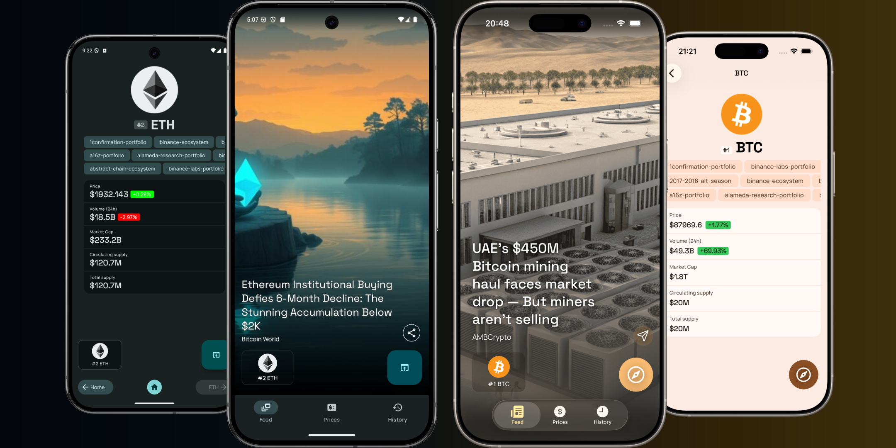

<h1>Cryptosphere</h1>

## About
**CryptoSphere** is a **Kotlin Multiplatform** cryptocurrency news feed app that utilizes [Coinstats](https://coinstats.app/) and [CoinMarketCap](https://coinmarketcap.com/) APIs.

## Features
- **Native UI** in 
  - **Jetpack Compose** on Android
  - **Swift UI** on iOS
- Intuitive **feed** for both news and related tokens
- **Browser-like** token discovery navigation mechanism with **in-app history**
- Tokens' **price list**
- **Dynamic** light/dark **themes**

## Used technologies
- [Decompose](https://arkivanov.github.io/Decompose/) - screen flows definition, state and backstack management
- [Coroutines](https://kotlinlang.org/docs/coroutines-guide.html) - asynchronous/concurrent programming
- [Skie](https://skie.touchlab.co/) - bridging certain kotlin features to swift
- [Room](https://developer.android.com/jetpack/androidx/releases/room) - database for on-device token/browsing history storage
- [WorkManager](https://developer.android.com/jetpack/androidx/releases/work) - periodic background token data sync
- [Ktor](https://ktor.io/) - network requests
- [MaterialKolor](https://materialkolor.com/) - dynamic theme 
- [Coil](https://coil-kt.github.io/coil/) - image loading
- [Moko resources](https://github.com/icerockdev/moko-resources) - common resource access on Android/iOS
